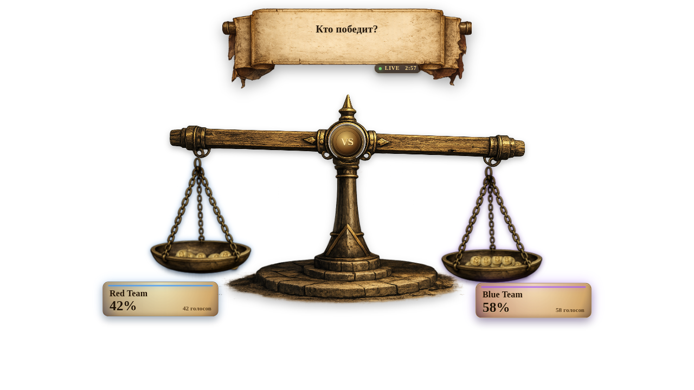

# Twitch Poll Scale Overlay

Визуализация **Twitch Poll** и **Channel Points battle** в реальном времени для OBS с анимированными весами, полосками или ранжированными списками.

```
Twitch EventSub WebSocket → Node.js Backend → WebSocket → OBS Browser Source
```

## Скриншот



**Показанные возможности:**
- Анимированные весы показывают распределение голосов в реальном времени
- Баннер с вопросом и метаданными
- Количество голосов и проценты для каждого варианта
- Поддержка прозрачности для OBS overlay

## Быстрый старт

### 1. Установи Node.js

Требуется **Node.js 20+** (npm идет в комплекте).

**Windows:**
1. Скачай и установи [Node.js LTS](https://nodejs.org/)
2. При установке оставь "Add to PATH" включенным
3. Перезагрузи терминал
4. Проверь:
   ```powershell
   node -v
   npm -v
   ```

**macOS / Linux:**
```bash
node -v
npm -v
```

### 2. Запусти Demo

```bash
npm run demo
```

Команда:
- Создаст `.env` со случайным `OVERLAY_TOKEN`
- Установит зависимости (если нужно)
- Запустит backend
- Откроет admin-панель в браузере

Ты увидишь URL-ы вроде:
```
Admin:    http://localhost:3030/admin?token=...
OBS URL:  http://localhost:3030/overlay?token=...&mode=scale&metric=votes
```

Скопируй OBS URL и добавь **Browser Source** в OBS:
- Размер: 1280×720
- Включи: "Refresh when visible" + "Shutdown when not visible"

## Настройка Twitch

### Создай Twitch Developer App

1. Перейди в [Twitch Developer Console](https://dev.twitch.tv/console)
2. Создай приложение
3. Установи **OAuth Redirect URL**: `http://localhost:3030/auth/callback`
4. Скопируй **Client ID** и **Client Secret**

### Конфигурация

Отредактируй `.env`:
```env
TWITCH_CLIENT_ID=ваш_client_id
TWITCH_CLIENT_SECRET=ваш_client_secret
TWITCH_REDIRECT_URI=http://localhost:3030/auth/callback
TWITCH_SCOPES=channel:read:polls channel:read:redemptions channel:manage:polls
```

### Авторизация

```bash
npm start
```

Перейди: `http://localhost:3030/auth/login`

После OAuth, EventSub автоматически подпишется на события poll.

## Добавление Custom Assets

Размещай кастомные assets в `public/assets/`:

```
public/assets/
├── scale-demo.png        # Кастомный фон весов (опционально)
├── my-item.png           # Изображение предмета
└── ...
```

Затем используй их в overlay URL:
```
?item=my-item
```

Требования к assets:
- Формат: PNG с прозрачностью
- Размер: ~200×200px для картинок предметов
- Имя: только буквы и цифры, без пробелов

## Основные команды

| Команда | Назначение |
|---------|-----------|
| `npm run demo` | Demo режим со случайным токеном |
| `npm start` | Реальный режим Twitch |
| `npm run urls` | Показать OBS URL-ы |
| `npm run doctor` | Диагностика |
| `npm test` | Запустить тесты |

## Решение проблем

**Порт 3030 занят:**
```bash
npm run demo -- --port 3010
```

**OBS показывает пустой экран:**
1. Проверь, запущен ли сервер
2. Убедись, что токен в URL совпадает с `.env`
3. Сначала протестируй URL в браузере

**Poll не обновляется:**
1. Подтвердил ли ты OAuth как стример
2. Проверь, правильные ли scopes в `.env`
3. Перезагрузи сервер после изменения scopes

## Ресурсы

- [Полная документация](docs/) — Архитектура, API, настройка OBS, интеграция Twitch
- [Технические docs](docs/API.md) — HTTP/WS endpoints
- [Twitch App Setup](docs/TWITCH_APP_KEYS.md) — Подробный OAuth flow

## Лицензия и поддержка

Смотри [LICENSE](LICENSE) для деталей.

---

**Требования:**
- Node.js 20+
- OBS Studio
- Аккаунт Twitch (для реального режима)
